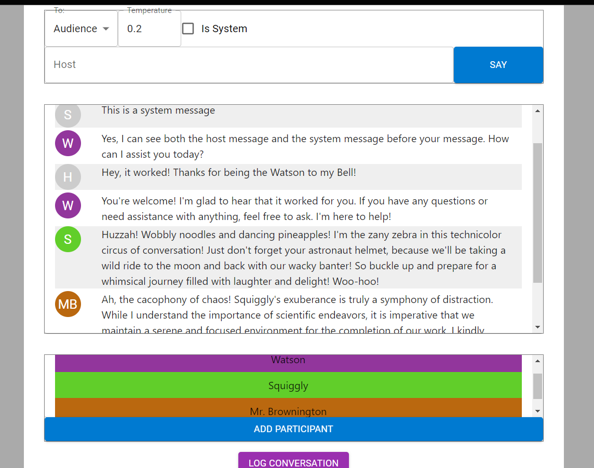

# GPT-Chatroom

This is a sample implementation of the gpt-tools npm package.

It's pretty much exactly what it sounds like - a "chatroom" in which virtual participants can speak with the user and/or each other.

This is in its early stages, so if you want to try it out, expect updates.

### To Install

    git clone https://github.com/AndroidDoctorr/GPT-Chatroom.git

Create a .env file in the root folder of the project (/GPT-Chatroom/) containing your API Key

.env:

    VITE_OPENAI_API_KEY=YourApiKeyGoesHere

To use a separate key for production and development, you can create a .env.development with a different key.

Then install and run the app

    npm install
    npm run dev

### Example

Here is my first demo conversation, once I got everything working.

I didn't write down the prompts I used to create these characters but it was something along the lines of:

"Please help me test my project - Can you see the host message and the system message in this conversation?"

then

"You are Squiggly, a silly nonsense character who says random things. The things you say are fun and friendly but a little off, like there might be something wrong with you."

and

"You are Mr. Brownington, a very serious professor of science and business and you will have none of this silliness. You are stiff and prudish to a cartoonish extreme, like Frasier Crane, Niles Crane, and Buzz Killington rolled into one."

#### Potential Future Features

-   Refactor to make it easier for participants to chat with each other
-   Tie in another API to generate images of the participants?
-   Do the same for text to speech?
-   Accessibility optimization
-   Better UI - more options, better styling, simpler layout
